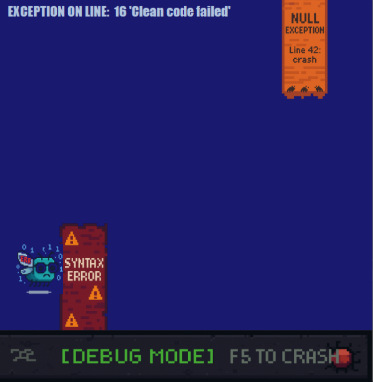

# 🐞 *BUG JUMP - Como Funciona*
*A chaotic journey through code errors!*  

Um jogo simples e divertido inspirado no Flappy Bird, mas com uma temática de programação. Controle um bug programador e desvie de obstáculos baseados em erros de código!

## 🎮 **Mecânica do Jogo**
🔹 Objetivo
Desvie dos obstáculos (SyntaxError, NullException) e aumente seu Clean Code Streak (pontuação).

Sobreviva o máximo possível enquanto os obstáculos ficam mais rápidos!

## 🕹️ **Controles**
| Ação | Tecla |  
|------|-------|  
| Pular | <kbd>Espaço</kbd> |  
| Reiniciar | <kbd>F5</kbd> |  

## 🚧 **Obstáculos**
| Nome | Cor | Descrição |  
|------|-----|-----------|  
| `SyntaxError` | 🟠 Laranja | Erro de sintaxe (topo) |  
| `NullException` | 🟣 Roxo | Erro de null reference (base) |  
| `DebugConsole` | ⚫ Cinza | Chão do terminal |  

Se colidir, aparece:

"EXCEPTION ON LINE: X 'Clean code failed'

## 💻 **Tecnologias Usadas**
Linguagem: C#

Framework: Windows Forms (.NET)

## 🔧 **Como Executar**
Clone o repositório:

bash
git clone https://github.com/gabrielvesal/BugJump.git
Abra o projeto no Visual Studio.

Compile e execute (F5).

## 👨‍💻 **Quer contribuir?**
Faça um fork, adicione melhorias e envie um PR!

🎮 Divirta-se e tente bater o high score!

  

💬 Dúvidas? Abra uma issue no GitHub!

🚀 Enjoy the bugs! 🐛💻
